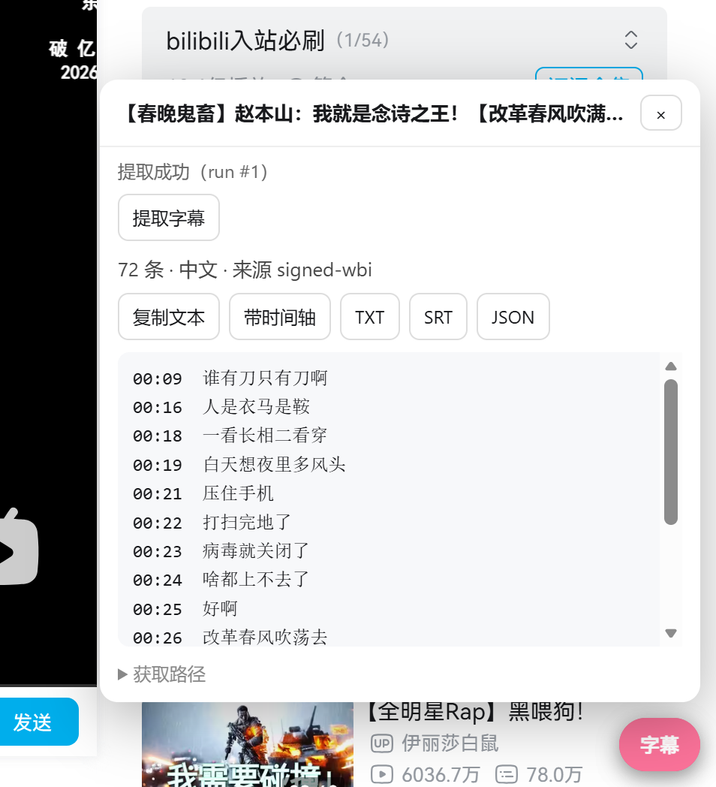
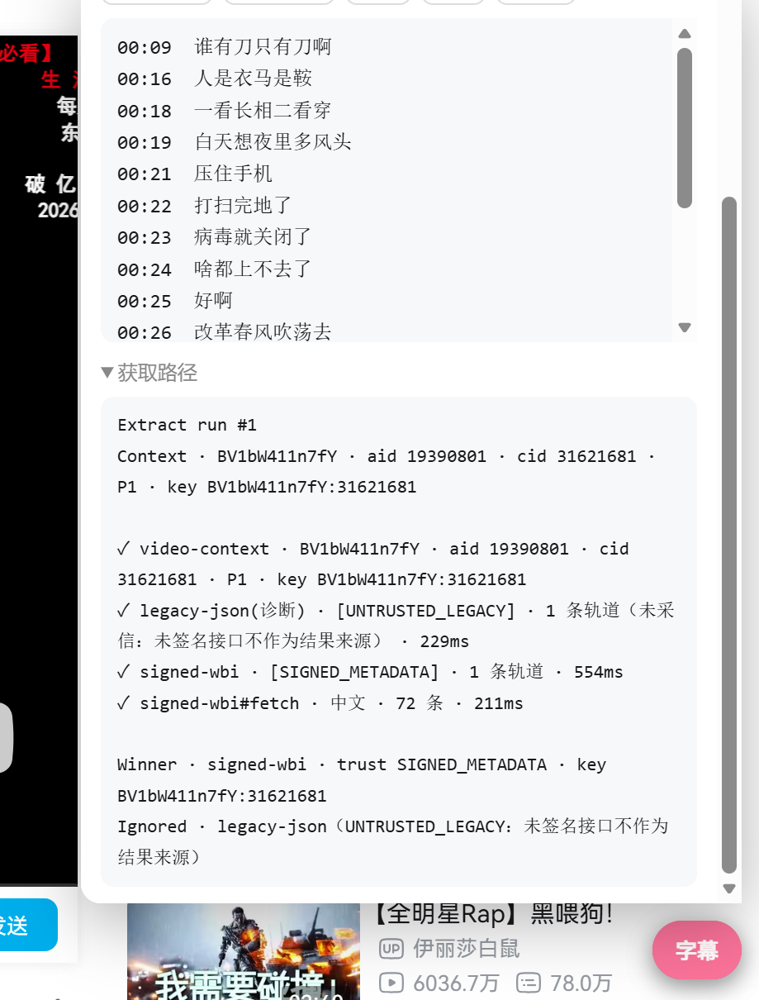
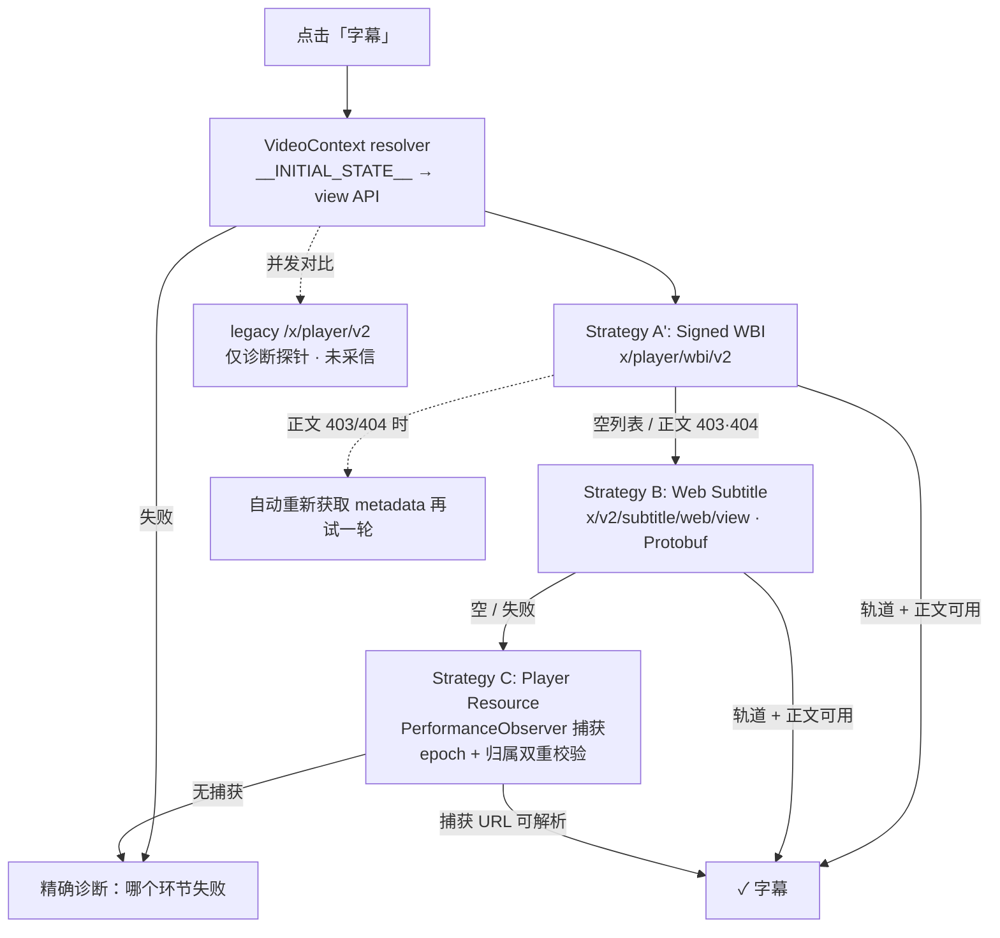

# bili-subtitle

> 弹性提取 Bilibili CC / AI 字幕的单文件 userscript。
> A resilient, zero-config Bilibili CC & AI subtitle userscript.

[English](#english) · 协议笔记见 [docs/PROTOCOL.md](docs/PROTOCOL.md)

**安装 / Install →** 推荐 [Greasy Fork](https://greasyfork.org/zh-CN/scripts/593554-bilibili-cc-ai-subtitle-extractor) · 备用 [GitHub Raw](https://raw.githubusercontent.com/ymt200120/bili-subtitle/main/bili-subtitle.user.js)
（需先安装 [Tampermonkey](https://www.tampermonkey.net/) 或 [Violentmonkey](https://violentmonkey.github.io/)；步骤见下文）

---

## 这是什么 / What it is

安装一个 `.user.js`，打开 B 站视频页，点右下角「字幕」，脚本自动在多条获取路径之间回退，把 B 站已经提供给当前用户的字幕取出来；取不出来时，明确告诉你**哪条路径失败、为什么、下一步做什么**。

```text
安装 userscript
    ↓
打开 Bilibili 视频
    ↓
点击「字幕」（自动开始提取）
    ↓
策略链自动尝试：WBI 签名 API → 新版 Protobuf API → 播放器已加载资源
    （未签名的旧版 API 仅作诊断对比，不作为字幕来源）
    ↓
成功提取，或给出精确诊断
```

用户不需要理解 `aid` / `cid` / `subtitle_url` / Protobuf / DevTools。

### 明确不做的事

- ❌ 不下载视频 / 音频，不调用任何 ASR / Whisper
- ❌ 不读取、不保存、不输出 Cookie（登录态由浏览器自动携带）
- ❌ 不上传任何数据，无 analytics / telemetry
- ❌ 不提供十种导出格式、批量下载、搜索中心（这些已有成熟项目，见下文）

**导出仅有**：复制纯文本、复制带时间轴文本、TXT、SRT、JSON。

## 安装 / Install

- **推荐（普通用户）：[Greasy Fork 安装](https://greasyfork.org/zh-CN/scripts/593554-bilibili-cc-ai-subtitle-extractor)** — 从 Greasy Fork 安装的副本由 Greasy Fork 管理更新
- **备用（开发/测试）：[GitHub Raw](https://raw.githubusercontent.com/ymt200120/bili-subtitle/main/bili-subtitle.user.js)** — 直接跟随仓库的 userscript metadata 更新

1. 安装 [Tampermonkey](https://www.tampermonkey.net/)（Chrome/Edge）或 [Violentmonkey](https://violentmonkey.github.io/)（Firefox）
2. 点击上方任一链接安装脚本
3. 打开任意 <https://www.bilibili.com/video/…> 页面，右下角出现「字幕」

## 截图 / Screenshots

### 字幕面板 / Subtitle panel



### 解析诊断 / Resolver diagnostics



> 实际浏览器诊断示例：unsigned legacy metadata 被标记为 `UNTRUSTED_LEGACY` 并忽略，`signed-wbi` 以 `SIGNED_METADATA` 身份成为 Winner。

## Resolver 架构 / Resolver architecture



要点：

- **字幕归属是 correctness 问题**：v1.0.2 引入 trust model——`SIGNED_METADATA`（WBI 签名）> `CURRENT_VIDEO_METADATA`（请求显式绑定 aid+cid）> `CURRENT_PLAYER_RESOURCE`（捕获 URL 已证明内嵌当前 cid/aid）；每条轨道、每个结果都绑定 `contextKey`（bvid:cid），面板与轨道选择只接受「可信 + 归属匹配」的内容
- **未签名旧版接口 `/x/player/v2` 降级为诊断探针**：有独立项目记录它在风控降级时返回 HTTP 200、内容合法但**属于其他视频**的字幕；它的结果只用于对比诊断与登录提示，永不作为字幕来源（详见 [docs/PROTOCOL.md](docs/PROTOCOL.md) §2/§2b）
- **fail-closed 原则**：宁可提示「无法可靠确认字幕归属」，也不显示可能来自其他视频的字幕
- 签名字幕 URL 短期有效（403/404）：脚本**不缓存**，自动重取 metadata
- 每次提取有 `run #N` 编号，面板「获取路径」显示 Context / 各策略 / Winner；Console 日志带 `[bili-subtitle] [run:N]` 前缀，`auth_key`/`w_rid`/`wts` 等一律遮蔽

诊断示例：

```text
Extract run #17
Context · BV1BbKw6XEWq · aid 116… · cid 40065631429 · P1 · key BV1BbKw6XEWq:40065631429

✓ video-context · BV1BbKw6XEWq · aid … · cid 40065631429 · P1 · key BV1BbKw6XEWq:40065631429
✓ [SIGNED_METADATA] signed-wbi · 1 条轨道
✓ signed-wbi#fetch · 中文（AI） · 1342 条
✓ [UNTRUSTED_LEGACY] legacy-json(诊断) · 1 条轨道（未采信：未签名接口不作为结果来源）

Winner · signed-wbi · trust SIGNED_METADATA · key BV1BbKw6XEWq:40065631429
Ignored · legacy-json（UNTRUSTED_LEGACY：未签名接口不作为结果来源）
```

## 为什么又造一个轮子？/ Why another subtitle extractor?

调研过的同类项目（截至 2026-08）：

| 项目 | 形态 | 已解决 | 未解决 |
|---|---|---|---|
| [DFameMaster/bilibili-transcript](https://github.com/DFameMaster/bilibili-transcript) | userscript | 10 种导出格式、分 P/合集、批量、搜索 | 无 AI 字幕回退、无诊断 |
| [YukinoAsuna/bilibili-subtitle-extractor](https://github.com/YukinoAsuna/bilibili-subtitle-extractor) | Chrome 扩展 + Python | 捕获播放器已加载的 AI 字幕 URL | 需开发者模式装扩展；需手动开 CC 后才能捕获 |
| [ainigo123/bilibili-subtitle](https://github.com/ainigo123/bilibili-subtitle) | TRAE Skill | AI Agent CLI 流程 | 非浏览器工具 |
| [ccBilly-aipm/bilibili-ai-subtitle](https://github.com/ccBilly-aipm/bilibili-ai-subtitle) | Python CLI | Protobuf 接口解析、403 重取 | 需从浏览器读 SESSDATA；CLI 形态 |
| [huanweide/bili-subtitle](https://github.com/huanweide/bili-subtitle) | userscript（已归档） | 普通 API 直取、语言选择 | 无 AI 回退；已停止维护 |

多格式导出、批量下载、Chrome 扩展、CLI、AI Agent 工作流——这些已经有更成熟的项目。本项目选择一个更窄的目标：

> **一个不需要 CLI、不需要扩展开发者模式、不需要导出 Cookie、尽可能自动跟随 Bilibili 接口变化的单文件 userscript。**

核心价值不在功能数量，而在：automatic fallback · diagnostics · zero configuration · small surface area。社区接口文档仓库 bilibili-API-collect 已于 2026-01 关停，接口漂移只会更频繁——这正是「策略链 + 诊断」设计存在的理由。

## 隐私 / Privacy

- 不读取、不存储、不输出 Cookie 或 SESSDATA；请求登录态由浏览器自动携带
- 不向任何第三方服务器发送数据；无 analytics / telemetry
- 日志（Console 与面板）中的短期签名参数一律遮蔽为 `***`
- 仅提取 B 站已提供给当前用户的字幕

## 验证状态 / Verification status

诚实声明，不做过度承诺：

| 层级 | 状态 |
|---|---|
| 单元测试（72 项：URL/字幕解析/SRT/Protobuf/策略链/WBI 签名向量/归属校验/日志脱敏） | ✅ `npm test` 全部通过 |
| WBI 签名算法（mixin_key 重排、w_rid 计算） | ✅ 与社区参考的确定性测试向量一致 |
| **跨视频字幕 bug（此前真实复现场景）** | ✅ **v1.0.2 已在真实浏览器验证：不再复现**（用户实测，2026-08-30） |
| 匿名接口行为（view API、player/v2 空列表、web/view 空protobuf） | ✅ 本机验证 2026-08-29，见 [docs/PROTOCOL.md](docs/PROTOCOL.md) |
| **signed-wbi 真实浏览器字幕提取** | ✅ **已验证**：真实视频页成功返回字幕轨并完成正文提取（见下方截图） |
| **trust model / Winner 行为** | ✅ **已验证**：`signed-wbi` 以 `SIGNED_METADATA` 成为 Winner，未签名 legacy metadata 被 `UNTRUSTED_LEGACY` 标记并忽略 |
| wbi/v2 匿名态完整行为、多账号/多风控场景矩阵 | ⚠️ 单一真实案例已验证，尚需更广覆盖 |
| 登录态系统性矩阵（多账号 / Strategy B web-view 轨道内容） | ⚠️ 尚需更多验证，协议依据见 PROTOCOL.md |
| Firefox + Violentmonkey 的 GM arraybuffer | ⚠️ 管理器声明支持，未实测 |

## 兼容性 / Compatibility

- 目标环境：Chrome + Tampermonkey；Firefox + Violentmonkey/Tampermonkey
- 匹配页面：`https://www.bilibili.com/video/*`、`/list/*`
- **不支持**：番剧页、移动端 m 站、国际化站
- `GM_xmlhttpRequest` 不可用时回退到页面内 `fetch`（部分场景可能受 CORS 限制，诊断会显示）

## 故障排查 / Troubleshooting

| 现象 | 诊断 | 处理 |
|---|---|---|
| `signed-wbi` 显示 code -352 / HTTP 412 | WBI 签名被风控拒绝 | 脚本会自动刷新密钥并重试一次；若反复出现，稍后重试并提 issue |
| 两个可信接口都显示「空轨道」 | 多数情况是未登录 | 登录 B 站后点「提取字幕」 |
| 提示「未签名接口返回了轨道，但无法证明归属」 | legacy 探针有轨道但未采信 | 这是预期保护行为；以可信接口/播放器捕获结果为准 |
| `signed-wbi#fetch` / `web-view#fetch` 显示 HTTP 403/404 | 签名字幕 URL 过期 | 脚本会自动重取；若仍失败，稍后重试 |
| `player-resource` 显示 ○（无捕获） | 播放器还没加载过字幕 | 在播放器打开「字幕/CC」选 AI 字幕，让字幕出现一次，再点「提取字幕」 |
| `player-resource` 显示「与当前视频不匹配」 | 捕获到的字幕 URL 无法证明属于当前视频 | 在播放器打开「字幕/CC」让播放器实际加载一次，再点「提取字幕」 |
| 面板不出现 | 脚本未注入 | 确认脚本管理器已启用且匹配当前页面 |
| 提取结果疑似不属于自己的视频 | — | v1.0.2 起未签名接口的结果永远不会展示；如仍遇到，复制面板「获取路径」整块内容（含 run #N）提 issue |

## 开发 / Development

零运行时依赖、零开发依赖：

```bash
npm test           # node --test，纯逻辑测试（无网络请求）
npm run build      # 拼接 src/ -> bili-subtitle.user.js
npm run build:check
```

```text
src/
├── 00-namespace.js      # BS 命名空间 + 版本
├── core/                # 纯逻辑：日志脱敏/模型/URL/网络/protobuf/导出/诊断/SPA
├── resolvers/           # video-context · legacy · web-view · player-resource · pipeline
├── ui/panel.js          # 轻量面板
└── main.js              # 装配与导出动作
```

修改 `src/` 后运行 `npm run build` 重新生成安装文件；测试与构建共用同一拼接规则（`scripts/pack.mjs`）。

## 历史 / History

`docs/prototype/1.js` 是本项目 v1.0.0 之前的真实可运行原型（已在真实 B 站视频上验证过基础链路），现归档作参考，不参与构建。

## Acknowledgements / Prior Art

本项目的技术路径站在以下公开项目的肩膀上，特此致谢（均为独立实现，未复制源码）：

- [ccBilly-aipm/bilibili-ai-subtitle](https://github.com/ccBilly-aipm/bilibili-ai-subtitle)：`/x/v2/subtitle/web/view` Protobuf 字段结构与 403 重取策略（协议依据详见 [docs/PROTOCOL.md](docs/PROTOCOL.md)）
- [JoeyTeng/bilibili-helper PR #4](https://github.com/JoeyTeng/bilibili-helper/pull/4)：真实 Chrome/Tampermonkey 环境对二进制 metadata 响应的验证
- [YukinoAsuna/bilibili-subtitle-extractor](https://github.com/YukinoAsuna/bilibili-subtitle-extractor)：播放器资源捕获思路
- [SocialSisterYi/bilibili-API-collect](https://github.com/SocialSisterYi/bilibili-API-collect)（已关停）：历史社区文档

本项目不是哔哩哔哩官方项目。仅处理当前用户有权访问的字幕内容，不负责字幕的重新分发；AI 字幕可能存在识别错误，请以视频原文为准。

## License

[MIT](LICENSE)

---

## English

A single-file userscript that extracts Bilibili CC & AI subtitles with automatic fallback:

```text
WBI-signed player metadata API (x/player/wbi/v2)
  ↓ empty / expired?
Web Subtitle metadata API (x/v2/subtitle/web/view, protobuf)
  ↓ empty / failed?
Player resource capture (PerformanceObserver, epoch + ownership proof)
  ↓ failed?
Precise per-strategy diagnostics (✓ / ✗ / ○ with runId, context and winner)
```

- Zero configuration, no cookie access, no telemetry, no video/audio download, no ASR
- Every track is bound to the video context (`contextKey` = bvid:cid) and a trust level; only trusted, context-matching tracks can be shown or selected — **fail closed: no subtitle is better than a valid subtitle from the wrong video**
- The unsigned legacy endpoint (`/x/player/v2`) is diagnostic-only: it has been reported (risk-control degradation) to return valid-looking subtitles belonging to a different video
- Signed subtitle URLs are never cached; 403/404 triggers automatic metadata re-fetch
- Player resource capture is reset on SPA navigation, and a captured URL is only used when it provably belongs to the current video (embeds the current cid, or the current aid on single-page videos)
- Exports: copy plain text, copy timestamped text, TXT, SRT, JSON
- Only 4 formats by design — the value is resilience and diagnostics, not feature count

**Why another extractor?** Other projects already cover multi-format export, batch download, CLI, Chrome extensions and AI-agent workflows (see the table above). This project targets one narrow goal: a single userscript that follows Bilibili's shifting subtitle endpoints automatically and tells you exactly why when it cannot. It is not affiliated with Bilibili; it only reads subtitles already offered to the current user.

**Verification status:** 72 unit tests pass (`npm test`), including deterministic WBI signing vectors and a regression test for the valid-but-wrong unsigned legacy response; anonymous endpoint behavior verified from a dev environment on 2026-08-29. The v1.0.2 resolver trust model was additionally validated in a real browser against the previously reproduced cross-video subtitle case. ✅ The signed-WBI path has been validated in a real browser: it returned a subtitle track, fetched the subtitle body, and became the authoritative winner, with the trust model observed working as intended (unsigned legacy metadata ignored). ⚠️ Anonymous sessions and additional browser / userscript-manager combinations still require broader validation — see [docs/PROTOCOL.md](docs/PROTOCOL.md) for protocol evidence and open items.

**Install:** [Greasy Fork](https://greasyfork.org/zh-CN/scripts/593554-bilibili-cc-ai-subtitle-extractor) (recommended, updates managed by Greasy Fork) or [GitHub Raw](https://raw.githubusercontent.com/ymt200120/bili-subtitle/main/bili-subtitle.user.js) (development, follows the repo metadata).
